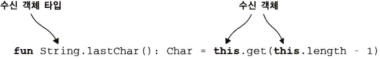
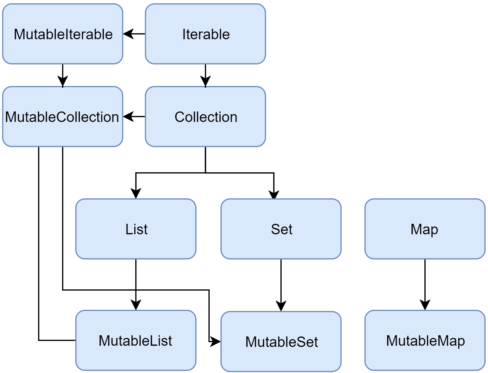

# 코틀린 공부 

공식 문서와 제공되는 [Playground](https://play.kotlinlang.org/byExample/overview) 에서 기반 공부

## 공부 내용 정리

공식 문서 및 플레이그라운드 내용 기반으로 작성

### 기본적인 문법

자바와 매우 유사함

#### 패키지와 import 구문

```kotlin
package study.kotlin

import kotlin.text.*
// ...
```
`디렉토리`와 `패키지`를 일치시키지 않아도 되며  
소스 파일은 파일 시스템에 임의로 배치 할 수 있음.

#### 프로그램 진입점
[소스 예제](src/main/kotlin/study/playground/intro/hello_world/HelloKT.kt)

코틀린 어플리케이션의 진입점은 `main` 함수.
```kotlin
fun main() {
    println("코틀린 공부!")
}
```

```kotlin
fun main(args: Array<String>) {
    //`main` 함수의 다른 양식으로 `String`타입의 파라미터를 받는 방식!
    println(args.contentToString())
}
```

#### 표준 출력

`print` 함수는 파라미터를 표준 출력한다.
```kotlin
print("Hello ")
print("world!")
```

`println` 함수는 파라미터와 그 끝에 줄바꿈을 추가한다.  
그 결과론 출력된 다음 항목이 다음 줄에 나타나게 된다.

```kotlin
println("Hello world!")
println(42)
```

#### 함수
[소스](src/main/kotlin/study/playground/intro/functions/Functions.kt)

두개의 `Int`타입 파라미터를 받아 `Int` 를 반환하는 간단한 함수.
```kotlin
fun sum(a: Int, b: Int): Int {
    return a + b
}
```

함수 본체는 표현식으로 작성가능하며, 반환 타입은 유추되는 형태.  

> 코틀린의 타입은 컴파일시 자바의 `primitive` 혹은 `wrapper` 타입으로 자동 변환

```kotlin
fun sum(a: Int, b: Int) = a + b
```

의미있는 값을 반환하지 않는 함수의 예시
```kotlin
fun printSum(a: Int, b: Int): Unit {
    println("sum of $a and $b is ${a + b}")
}
```

`Unit` 타입의 경우 반환유형에서 생략할 수 있음.
```kotlin
fun printSum(a: Int, b: Int) {
    println("sum of $a and $b is ${a + b}")
}
```

##### `infix` 함수
[소스](src/main/kotlin/study/playground/intro/functions/InfixFunctions.kt)

__표기법__

`infix` 키워드로 표시된 함수는  
인픽스 표기(호출의 점이나 괄호를 생략)를 사용하여 호출할 수도 있음.

`Infix` 함수는 다음을 충족해야함
* `멤버 함수` 또는 `확장 함수`
* 하나의 파라미터만을 가져야함.
* 파라미터는 가변 개수의 인수를 허용하지 않아야하며 기본값이 없어야함.

```kotlin
infix fun Int.shl(x: Int): Int { /*...*/ }

// . () 생략하는 호출식
1 shl 2

// 위와 같은 방식이나 생략 안함
1.shl(2)
```

##### Operator Functions

`operators` 들은 오버라이딩이 가능.

```kotlin
operator fun Int.times(str: String) = str.repeat(this)
println(2 * "안녕! ") // Int * -> times 표준 함수                                          

operator fun String.get(range: IntRange) = substring(range)
val str = "매우 긴 문자열로 테스트해보자, 테스트용 문자열!"
println(str[0..14]) // String [?] -> String 표준 함수              
```

##### 가변 파라미터 사용 함수

함수 선언시 파라미터 앞에 `varargs` 붙여서 선언시  
가변적으로 파라미터를 받을 수 있음

```kotlin
fun <T> asList(vararg ts: T): List<T> {
    val result = ArrayList<T>()
    for (t in ts) // ts is an Array
        result.add(t)
    return result
}

val list = asList(1,2,3);
```

#### 변수
[소스](src/main/kotlin/study/playground/intro/variables/Variables.kt)

코틀린은 강력한 타입 추론으로 타입을 명시하지 않아도,  
변수가 선언될 때 할당된 값의 형태로 어떤 자료형을 가지는지 추론해준다.

변수 유형을 명시적으로 선언할 수 있지만  
일반적으로 컴파일러가 변수를 추론하여 작업을 수행하도록 합니다.  
`Kotlin`은 불변성을 강제하진 않지만 권장됩니다.  
본질적으로 `var`보다는 `val`을 사용해야 한다. 

```kotlin
val a: Int = 1  // 즉시 할당
val b = 2   // `Int` 타입으로 유추
val c: Int  // 초기화하지 않는 경우 타입이 필요
c = 3       // 지연 초기화
```

#### Null Safety

코틀린에서의 `Null Safety` 

코틀린에서 변수 유형은 기본적으로 `null`할당을 허용하지 않음.  
`null` 변수가 필요한 경우 변수 타입 선언시 `?`을 추가하여 `nullable`로 선언함.

```kotlin
fun parseInt(str: String): Int? {
    // ...
}
```

#### 클래스

코틀린에서의 클래스 선언 키워드는 `class` 로 다음과 같음.
```kotlin
class SomeThing { /*...*/ }
```

클래스 선언은 클래스 이름, 클래스 헤더 (매겨 변수 지정, 기본 생성자 지정 등)  
중괄호로 둘러싸인 클래스 본문으로 구성됨.  
헤더와 바디 모두 선택사항으로 내용이 없을 경우 중괄호를 생략할 수 있음.
```kotlin
class EmptyClass
```

##### 생성자

코틀린의 클래스에는 ___기본 생성자___ 와 하나 이상의 보조 생성자가 있을 수 있음.  
기본 생성자의 경우 클래스의 헤더의 일부.
```kotlin
class Person constructor(firstName: String) { /*...*/ }
```

기본 생성자가 어노테이션이나 코드상으로 나타내는 변경자가 없을 경우  
`constructor` 키워드를 생략할 수 있음.

기본 생성자는 코드를 포함할 수 없음.  
초기화 코드는 키워드에 미리 고정된 초기화 블록에 배치할 수 있음 `init`

인스턴스 초기화 중에 ___초기화 블록___ 은  
클래스 본문이 나타나는 것과 동일한 순서로 실행되며 속성 이니셜라이져와 인터리브됨.

기본 생성자의 매개 변수는 초기화기 블록에 사용될 수 있음.  
또 클래스 본문에 선언된 속성 이니셜라이저에도 사용할 수 있음.

```kotlin
class Customer(name: String) {
    val customerKey = name.toUpperCase()
}
```

코틀린에서의 속성을 선언하고 기본 생성자에서 초기화하기 위한 간단한 구문

```kotlin
class Person(val firstName: String, val lastName: String, var age: Int) { /*...*/ }
//
class Person2(
    val firstName: String,
    val lastName: String,
    var age: Int, 
) { /*...*/ }
```

일반적인 변수의 속성과 동일하게, 기본 생성자에서 선언된 속성은  
읽기 전용 `val` 혹은 변경 가능 `var`일 수 있음.

#### 제네릭

코틀린에서의 제네릭

```kotlin
class Box<T>(t: T) {
    var value = t
}
```

제네릭 생성시 타입을 선언해야 함.
```kotlin
val box: Box<Int> = Box<Int>(1)
```

다만 생성자 파라미터 값이나 어떤 방식으로든 타입 추론이 가능할시 생략가능.
```kotlin
val box = Box(1)
```

#### 상속

코틀린에서의 모든 클래스는 `Any` 라는 슈퍼타입이 없는 클래스의 기본 슈퍼 클래그가 있음.

```kotlin
class Example //`Any` 를 상속받음
```

`Any`에는  
`equals ()`, `hashCode ()` 및 `toString ()`의 세 가지 메소드가 있음.  
코틀린내에 모든 클래스에 대해 정의됨.

기본적으로 코틀린내에서 클래스는 최종 클래스이며 상속 될 수 없음.  
클래스를 상속 가능하게 만들려면 `open` 키워드를 사용해야함
```kotlin
open class Base //상속가능한 클래스 
```
```kotlin
open class Base(p: Int)

class Derived(p: Int) : Base(p)
```

파생 클래스에 __기본 생성자가 있는 경우__  
기본 생성자의 매개 변수를 사용하여 기본 클래스를 바로 초기화 할 수 있음

파생 클래스에 __기본 생성자가 없는 경우__  
각 보조 생성자는 `super` 키워드를 사용하여 기본 형식을 초기화하거나  
이를 수행하는 다른 생성자에 위임해야 함.  
이 경우 다른 보조 생성자는 기본 유형의 다른 생성자를 호출 할 수 있음

```kotlin
class MyView : View {
    constructor(ctx: Context) : super(ctx)

    constructor(ctx: Context, attrs: AttributeSet) : super(ctx, attrs)
}
```
### 흐름 제어

#### 조건 표현식

if 구문.
```kotlin
fun maxOf(a: Int, b: Int): Int {
    if (a > b) {
        return a
    } else {
        return b
    }
}
```

#### Loop

For 구문
```kotlin
val items = listOf("사과", "바나나", "키위")
for (item in items) {
    println(item)
}
```

While 구문
```kotlin
val items = listOf("사과", "바나나", "키위")
var index = 0
while (index < items.size) {
    println("item at $index is ${items[index]}")
    index++
}
```
#### When

When 구문
```kotlin
fun describe(obj: Any): String =
    when (obj) {
        1 -> println("하나") //1 과 동일한지
        "안녕?" -> println("안녕!") // 문자열과 동일한지
        is Long -> println("$obj 는 Long 타입.") //타입이 같은지
        !is String -> println("$obj 는 String 이 아님.") //타입이 다른지
        else -> println("아몰랑") //디폴트
    }
```

#### Ranges

범위 지정 반복문

```kotlin
val x = 10
val y = 9
if (x in 1..y+1) {
    println("범위 지정 반복문")
}

val list = listOf("가","나","다")

if (-1 !in 0..list.lastIndex) {
    println("-1 은 범위 밖")
}
if (list.size !in list.indices) {
    println("범위 지정 반복문도")
}

for (x in 1..10 step 2) {
    print(x)
}
println()
for (x in 9 downTo 0 step 3) {
    print(x)
}
```

### 클래스 

#### Data 클래스

데이터를 보관하는 것이 주 목적인 클래스를 만드는 경우  
이러한 클래스에서 __일부 표준 기능__ 과 __유틸리티 함수__ 는 종종 데이터에서 기계적으로 파생  
코틀린에서는이를 `데이터 클래스`라고하며 `data`로 표시

컴파일러에서는 기본 생성자에서 선언된 모든 속성에서 다음 함수를 선언

* `equals()`/ `hashCode()` 

* `toString()` "User(name=John, age=42)" 와 같은...

* `componentN()` 선언 순서로 속성에 대응하는 함수

* `copy()` 깊은 복사가 아닌 얕은 복사

생성된 코드의 일관성과 의미 있는 동작을 보장하기 위해 데이터 클래스의 요구 사항
* 기본 생성자는 하나 이상의 매개 변수
* 모든 기본 생성기 매개 변수는 또는 `val` `var` 로 표시
* 데이터 클래스는 `abstract`, `open`, `sealed` 또는 `inner`일 수 없음

#### Enum 클래스

열거 클래스의 기본적인 사용법

```kotlin
enum class Direction {
    NORTH, SOUTH, WEST, EAST
}
```

각 열거 상수는 객체로, 쉼표로 구분됨

##### 익명 클래스

열거형 상수는 기본 메서드를 재정의 할뿐만 아니라  
해당 메서드를 사용하여 자체 익명 클래스를 선언 할 수도 있음.

```kotlin
enum class ProtocolState {
    WAITING {
        override fun signal() = TALKING
    },

    TALKING {
        override fun signal() = WAITING
    };

    abstract fun signal(): ProtocolState
}
```

열거형 클래스가 멤버를 정의하는 경우  
세미콜론으로 멤버 정의에서 열거 형 상수 정의를 분리합니다.

##### Enum 클래스에서의 인터페이스 상속

열거형 클래스는 인터페이스를 구현할 수 있지만 (클래스에서 파생되지는 않음)  
모든 항목에 대해 단일 인터페이스 멤버 구현을 제공하거나  
익명 클래스 내의 각 항목에 대해 별도의 구현을 제공.  
다음과 같이 열거형 클래스 선언에 인터페이스를 추가
```kotlin
enum class IntArithmetics : BinaryOperator<Int>, IntBinaryOperator {
    PLUS {
        override fun apply(t: Int, u: Int): Int = t + u
    },
    TIMES {
        override fun apply(t: Int, u: Int): Int = t * u
    };

    override fun applyAsInt(t: Int, u: Int) = apply(t, u)
}
```

##### 열거형 상수로 사용할때

코틀린의 열거형 클래스에는 정의된 열거형 상수를 나열하고  
이름으로 열거형 상수를 가져 오는 합성 메서드가 있습니다.  
```kotlin
EnumClass.valueOf(value: String): EnumClass
EnumClass.values(): Array<EnumClass>
```

`valueOf ()` 메서드는 지정된 이름이 클래스에 정의된 열거형 상수와 일치하지 않는 경우 
`IllegalArgumentException` 예외를 발생.

`enumValues <T> ()` 및 `enumValueOf <T> ()` 함수를 사용하여  
일반적인 방법으로 열거형 클래스의 상수에 액세스 가능

```kotlin
enum class RGB { RED, GREEN, BLUE }

inline fun <reified T : Enum<T>> printAllValues() {
    print(enumValues<T>().joinToString { it.name })
}

printAllValues<RGB>() // prints RED, GREEN, BLUE
```

모든 열거 형 상수에는 열거형 클래스 선언에서 이름과 위치를 가져 오는 속성이 있습니다.

```kotlin
val name: String
val ordinal: Int
```
열거형 상수는 또한 `Comparable` 인터페이스를 구현하며,  
자연적인 순서는 열거 형 클래스에 정의 된 순서

#### Sealed 클래스

~~이걸 봉인된 클래스라고 해야되나~~

봉인된 클래스는 상속에 대한 더 많은 제어를 제공하는 제한된 클래스 계층을 나타냄  
봉인된 클래스의 모든 하위 클래스는 컴파일 타임에 알려짐  
봉인된 클래스가 있는 모듈이 컴파일 된 후에는 다른 하위 클래스가 나타날 수 없음  
예를 들어 타사 클라이언트는 코드에서 봉인된 클래스를 확장 할 수 없음  
따라서 봉인된 클래스의 각 인스턴스에는 이 클래스가 컴파일 될 때 알려진 제한된 집합의 형식이 있음.

어떤 의미에서 봉인된 클래스는 열거형 클래스와 비슷  
열거형 유형에 대한 값 집합도 제한되지만 각 열거형 상수는 단일 인스턴스로만 존재하는 반면  
봉인된 클래스의 하위 클래스는 각각 자신의 상태로 인스턴스로 가질 수 있음

```kotlin
sealed class Expr
data class Const(val number: Double) : Expr()
data class Sum(val e1: Expr, val e2: Expr) : Expr()
object NotANumber : Expr()
```
#### Object 키워드

경우에 따라 새 하위 클래스를 명시적으로 선언하지 않고  
일부 클래스를 약간 수정하는 개체를 만들어야 하는 경우가 있습니다.  
코틀린은 이 사례를 `object expressions` 및 `object declarations`으로 처리합니다.

##### Object expressions

개체 식은 익명 클래스의 개체,  
즉 클래스 선언으로 명시적으로 선언되지 않은 클래스를 만듭니다.  
이러한 클래스는 한 번만 사용하면 편리합니다.  
처음부터 정의하거나 기존 클래스에서 상속하거나 인터페이스를 구현할 수 있습니다.  
익명 클래스의 인스턴스는 이름이 아닌 식으로 정의되기 때문에 익명 개체라고도합니다.

```kotlin
val helloWorld = object {
    val hello = "Hello"
    val world = "World"
    // 객체 표현식은 `Any` 확장하며, `toString()` 메소드를 `override`
    override fun toString() = "$hello $world" 
}
```

### 함수

#### 함수 타입

함수 타입을 정의하려면 함수 파라미터의 타입을 괄호 안에 넣고,
그 뒤에 화살표(→)를 추가한 다음, 함수의 반환 타입을 지정하면 됨.
```kotlin
val sample = {a :Int, b: String -> Unit}
```
코틀린 함수 타입 문법

#### 고차 함수

[소스](src/main/kotlin/study/playground/functional/HighOrderFunc.kt)

고차 함수는 다른 함수를 인자로 받거나 함수를 반환하는 함수

코틀린에서는 람다나 함수 참조를 사용해 함수를 값으로 표현 가능.

따라서 고차 함수는 람다나 함수 참조를 인자로 넘길 수 있거나 람다나 함수 참조를 반환하는 함수.

물론 함수를 인자로 받는 동시에 함수를 반환하는 함수도 고차 함수.

#### 람다 함수

[소스](src/main/kotlin/study/playground/functional/LambdaFunc.kt)

> 람다 식 lambda expression 또는 람다는 기본적으로다른 함수에 넘길 수 있는 작은 코드 조각을 뜻한다

람다를 사용하면 쉽게 공통 코드 구조를 라이브러리 함수로 뽑아낼 수있다.

코틀린 표준 라이브러리는 람다를 아주 많이 사용한다.

람다를 자주 사용하는 경우로 컬렉션 처리를 들 수 있다

##### 문법

람다는 값처럼 여기저기 전달할 수 있는 동작의 모음이다

```kotlin
{x: Int, y: Int -> x + y }
//파라미터         본문
```

코틀린 람다 식은 항상 중괄호로 둘러싸여 있으며,

인자 목록 주면에 괄호가 없음.

화살표 인자(→)가 인자 목록과 람다식 본문을 구분해줌.

```kotlin
val people = listOf(Person("Alice", 29), Person("Bob", 31))

println(people.maxBy{ it.age })

```

코틀린이 코드를 줄여 쓸 수 있는 기능을 제거 할 경우

정식으로 람다 작성시

```kotlin
println(people.maxBy({ p: Person -> p.age})
```

매우 번잡하고, 구분자가 많아 가독성이 떨어짐

컴파일러가 문맥으로 유추할 수 잇는 인자 타입을 적을 필요 없음

```kotlin
println(people.maxBy { p:Person -> p.age })
```

코틀린에는 함수 호출 시

맨 뒤에 있는 인자가 람다 식이라면 그 람다를 괄호 밖으로 빼낼 수 있다는 문법 관습이 있다.

이 예제에서는 람다가 유일한 인자이므로 마지막 인자이기도 하다. 

__따라서 괄호 뒤에 람다를 둘 수 있음__

람다가 어떤 함수의 유일한 인자이고 괄호 뒤에 람다를 썼다면 호출시 빈 괄호를 없애도 된다

> 람다가 함수의 유일한 인자라면   
> 여러분은 분명 괄호 없이 람다를 바로 쓰기를 원하게 될 것이다.  
> 인자가 여럿 있는 경우에는 람다를 밖으로 빼낼 수도 있고   
> 람다를 괄호 안에 유지해서 함수의 인자임을 분명히 할 수도 있다.  
> 
> 
> __두 방식 모두 정당하다.__   
> 둘 이상의 람다를 인자로 받는함수라고 해도  
> 인자 목록의 맨 마지막 람다만 밖으로 뺼 수 있다.  
> 따라서 그런 경우에는 괄호를 사용하는 일반적인 함수 호출 구문을 사용하는 편이 낫다

관련 내용이 꼬리에 꼬리를 계속 물어 방대해 이곳에는 생략함

#### 확장 함수

[소스](src/main/kotlin/study/playground/functional/ExtensionFunc.kt)

확장 함수는 어떤 클래스의 멤버 메소드인 것처럼 호출할 수 있지만 그 클래스의 밖에서 선언된 함수

확장 함수를 만들려면 추가하려는 함수 이름 앞에  
그 함수가 확장할 클래스의 이름을 덧붙이기만 하면 된다.

클래스 이름을 수신 객체 타입(receiver type) 이라 부르며

확장 함수가 호출되는 대상이 되는 값(객체)을 수신 객체(receiver object) 라고 부른다



### 컬렉션

코틀린에서의 컬렉션 기능은 자바와 동일하나

불변(__immutable__) 과 가변(__mutable__) 두 유형이 있다.


코틀린의 컬렉션 인터페이스 다이어그램

#### List

`List`는 정렬 된 항목 모음으로  
`Kotlin`에서 목록은 변경 가능 (__MutableList__)  
또는  
읽기 전용 (__List__) 일 수 있습니다.  
목록 생성의 경우 __읽기 전용 목록__ 에는 표준 라이브러리 함수 `listOf ()`를 사용하고  
__변경 가능한 목록__ 에는 `mutableListOf ()`를 사용합니다.

__원치 않는 수정을 방지하려면 변경 가능한 목록을 `List`로 캐스팅하여  
읽기 전용보기를 가져옵니다.__

#### Set

집합은 중복을 지원하지 않는 정렬되지 않은 컬렉션입니다.

집합을 만들기위한 함수 `setOf ()` 및 `mutableSetOf ()`가 있습니다.

변경 가능한 집합의 읽기 전용보기는 Set로 캐스팅하여 얻을 수 있습니다.

---
`Set <T>`는 고유 한 요소를 저장합니다.

그들의 순서는 일반적으로 정의되지 않습니다.

`null` 요소도 고유합니다.

`Set`에는 하나의 `null` 만 포함될 수 있습니다.

두 `Set` 이 같을 경우
→ 두 컬렉션 크기가 동일하고, 각각의 요소가 동일함

`MutableSet`은 `MutableCollection`의 쓰기 작업이있는 `Set`입니다.

`Set`의 기본 구현 → `LinkedHashSet`  요소 삽입 순서를 유지합니다.
따라서 `first ()` 또는 `last ()`와 같이 순서에 의존하는 함수는 이러한 집합에 대해 예측 가능한 결과를 반환합니다.

대체 구현 인 `HashSet`는 요소 순서에 대해 아무 말도하지 않으므로
이러한 함수를 호출하면 예측할 수없는 결과가 반환됩니다.
그러나 `HashSet`은 동일한 수의 요소를 저장하는 데 더 적은 메모리가 필요합니다.
